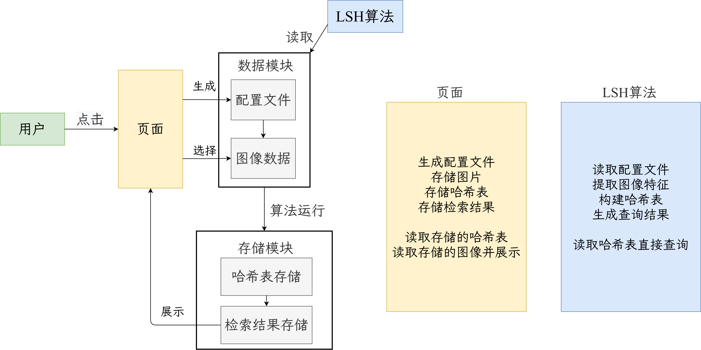

# 基于 `SeetaFaceEngine` 的人脸图像检索系统 :fire:

来源于课程大作业，时间紧迫，后期还会改进。在 `Arch` 下，`opencv4` 的环境中编译通过 `SeetaFaceEngine`，并融入 `LSH` 算法，实现人脸图像检索系统。即总体流程为：`SeetaFaceEngine` 提取人脸特征，用 `LSH` 实现 ANNS。

- 共 13466 张图像，`160X216`大小的图像，每秒检测 20 张。
- 构建哈希表时，选择1024个哈希函数，两张哈希表，每秒哈希 50 张图像，
- 对 100 张人脸进行查询，每张人脸返回最接近的 5 张图像。查询平均耗时：0.86 秒，最低 0.34 秒，召回率：100% 。

## Arch 安装所需库 :rocket:

```sh
sudo pacman -S cmake
sudo pacman -S make
# 安装 opencv
sudo pacman -S opencv vtk hdfs5
```

## 编译 SeetaFaceEngine :bell:

[`SeetaFaceEngine`](https://github.com/seetaface/SeetaFaceEngine) 来自中国科学院大学的开源，除了测试代码外，其余代码是可以编译通过的。注意，按识别、对齐、确认这三个项目的顺序编译。

1. `FaceDetection` 可以编译通过
2. `FaceAlignment` 测试代码使用了老旧接口无法编译通过，在 `CmakeLists` 中删除这一部分
3. `FaceIdentification` 测试代码无法编译通过，修改头文件，删除宏定义，并将人脸识别部分的代码按照 `FaceDetection` 中的代码重写。而后编译通过。

注意，如果出现地址错误或内存溢出等，注意检查模型、图片、链接库的路径，其实这些路径都是要自己改的。

编译通过后，调用 [特征提取](https://github.com/muyuuuu/SeetaFace-Retri/blob/main/FaceIdentification/src/test/face_image_extract.cpp)，生成人脸图像的特征数据并保存。 

## 局部敏感哈希算法 :bulb:

参考了 [cchatzis](https://github.com/cchatzis/Nearest-Neighbour-LSH) 的程序，他这边接口写的很明确了，但是程序有很多错误。我又好好研究一下 LSH 算法，重写了一版新的代码。

- [] 保存哈希函数、哈希表
- [] 读取配置文件
- [] 读取哈希函数、哈希表，直接查询

## 部署 :fire:

暂时按照如下结构部署到服务器，`Java` 施工中。

